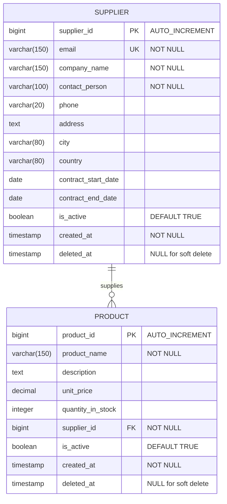

# Supplier Management System - Database Schema

## ER Diagram

## Database Tables

### SUPPLIER Table
The `supplier` table stores information about suppliers/vendors.

**Columns:**
- `supplier_id` (BIGINT, PRIMARY KEY, AUTO_INCREMENT): Unique identifier for each supplier
- `email` (VARCHAR(150), UNIQUE, NOT NULL): Supplier's email address (unique constraint)
- `company_name` (VARCHAR(150), NOT NULL): Name of the supplier company
- `contact_person` (VARCHAR(100), NOT NULL): Name of the contact person
- `phone` (VARCHAR(20)): Contact phone number
- `address` (TEXT): Full address of the supplier
- `city` (VARCHAR(80)): City where the supplier is located
- `country` (VARCHAR(80)): Country of the supplier
- `contract_start_date` (DATE): Contract start date with the supplier
- `contract_end_date` (DATE): Contract end date with the supplier
- `is_active` (BOOLEAN, DEFAULT TRUE): Status of the supplier (active/inactive)
- `created_at` (TIMESTAMP, NOT NULL): Record creation timestamp
- `deleted_at` (TIMESTAMP, NULL): Soft delete timestamp

**Indexes:**
- PRIMARY KEY on `supplier_id`
- UNIQUE INDEX on `email`

---

### PRODUCT Table
The `products` table stores information about products supplied by suppliers.

**Columns:**
- `product_id` (BIGINT, PRIMARY KEY, AUTO_INCREMENT): Unique identifier for each product
- `product_name` (VARCHAR(150), NOT NULL): Name of the product
- `description` (TEXT): Detailed description of the product
- `unit_price` (DECIMAL): Price per unit
- `quantity_in_stock` (INTEGER): Available quantity in stock
- `supplier_id` (BIGINT, FOREIGN KEY, NOT NULL): Reference to the supplier
- `is_active` (BOOLEAN, DEFAULT TRUE): Status of the product
- `created_at` (TIMESTAMP, NOT NULL): Record creation timestamp
- `deleted_at` (TIMESTAMP, NULL): Soft delete timestamp

**Indexes:**
- PRIMARY KEY on `product_id`
- FOREIGN KEY on `supplier_id` references `supplier(supplier_id)`

**Constraints:**
- Foreign Key: `supplier_id` REFERENCES `supplier(supplier_id)`

---

## Relationships

### One-to-Many: SUPPLIER → PRODUCT
- One supplier can have multiple products
- Each product belongs to exactly one supplier
- Relationship implemented via `supplier_id` foreign key in the `products` table
- Cascade operations: When a supplier is deleted (soft delete), their products remain but can be queried separately

---

## Soft Delete Implementation

Both tables implement soft delete functionality:
- Records are not physically deleted from the database
- Instead, the `deleted_at` column is set to the current timestamp
- Hibernate annotations ensure deleted records are automatically excluded from queries:
  - `@SQLDelete` annotation updates the `deleted_at` field
  - `@Where` annotation filters out records where `deleted_at IS NULL`

---

## Key Features

1. **Email Uniqueness**: Ensures no duplicate supplier emails in the system
2. **Referential Integrity**: Products are linked to valid suppliers through foreign key constraints
3. **Soft Delete**: Data preservation for audit and recovery purposes
4. **Timestamps**: Automatic tracking of record creation
5. **Active/Inactive Status**: Flexible status management for both suppliers and products
6. **Contract Management**: Track supplier contract periods for better vendor management

---

## Business Rules

1. **Supplier Creation**: Email must be unique across all suppliers
2. **Product Creation**: Must be associated with an existing active supplier
3. **Supplier Deletion**: Soft delete preserves historical data
4. **Product Listing**: Can filter products by supplier to view supplier portfolio
5. **Active Status**: Provides ability to temporarily disable suppliers/products without deletion
